# RE/MAX - Uživatelská příručka

## Obsah

1. [Úvod](#úvod)
2. [Pro nepřihlášené uživatele](#pro-nepřihlášené-uživatele)
3. [Pro klienty](#pro-klienty)
4. [Pro makléře](#pro-makléře)

---

## Úvod

RE/MAX je webová aplikace pro správu realitních nemovitostí.

**Hlavní role v systému:**
- **Nepřihlášení uživatelé** - prohlížení nemovitostí, recenzí a profilů makléřů
- **Klienti** - vše výše + plánování schůzek, psaní recenzí, správa profilu
- **Makléři** - vše výše + správa nemovitostí, potvrzování schůzek

---

## Pro nepřihlášené uživatele

Nepřihlášení uživatelé mají přístup k základním funkcím pro prohlížení informací.

### Dostupné funkce

#### 1. Prohlížení nemovitostí
- Seznam všech dostupných nemovitostí (navigace: **"Nemovitosti"**)
- **Filtrování**: typ nemovitosti (byt/dům/pozemek), status, typ transakce, cena, plocha, počet pokojů
- **Zobrazené informace**: fotografie, název, cena, plocha, adresa, typ, status

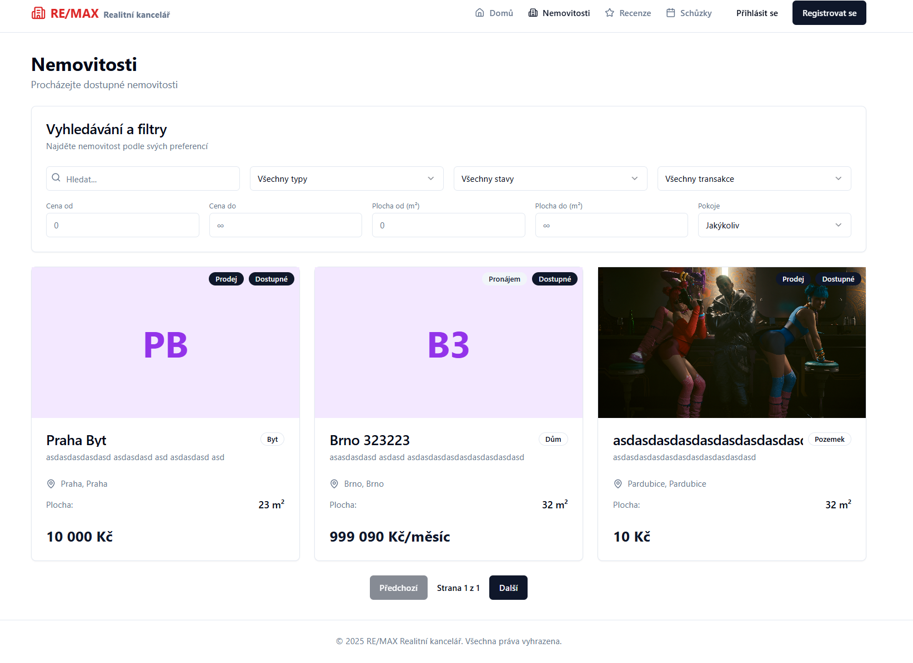

#### 2. Detail nemovitosti
Kliknutím na nemovitost zobrazíte kompletní informace v záložkách:
- **Detaily** - základní parametry (plocha, vybavení, počet pokojů atd.)
- **Parametry budovy** - materiál, stav, energetická třída, lokalita
- **Vybavení** - inženýrské sítě, internet, parkování
- **Doprava** - dostupné typy dopravy v okolí
- **Občanská vybavenost** - služby v okolí (školy, obchody, zdravotnictví)
- **Kontakt na makléře** - jméno, telefon, e-mail, možnost naplánovat schůzku (pouze pro přihlášené)
- **Mapa** - interaktivní mapa s lokací nemovitosti

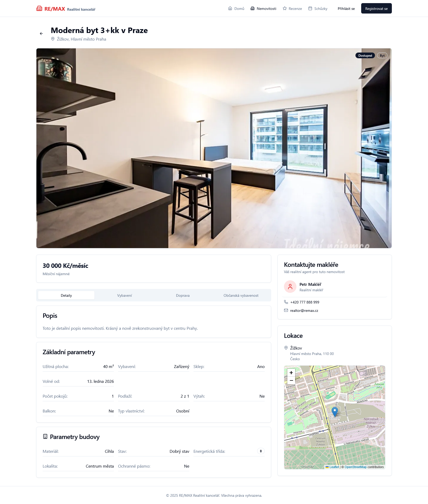

#### 3. Recenze makléřů
- Přehled všech recenzí (navigace: **"Recenze"**)
- **Statistiky**: celkový počet, průměrné hodnocení
- **Filtrování**: vyhledávání, počet hvězd
- **Zobrazené informace**: autor, makléř, hodnocení, text, datum

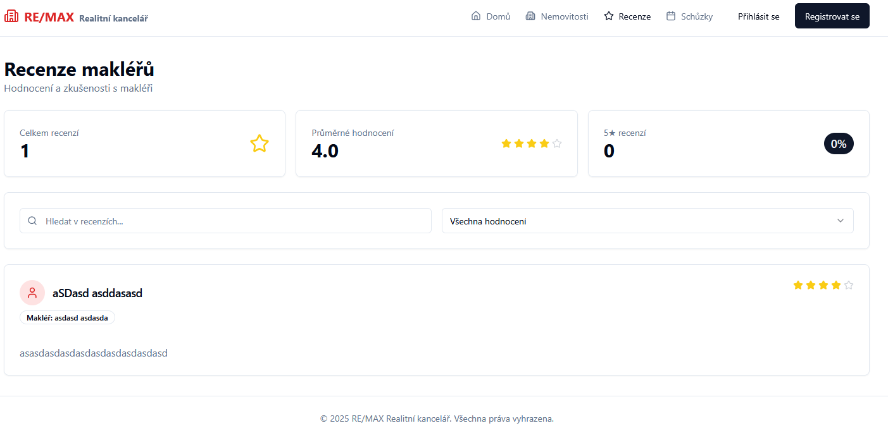

#### 4. Profil makléře
Kliknutím na jméno makléře zobrazíte:
- **Základní údaje**: foto, jméno, e-mail, telefon, biografie
- **Záložka Nemovitosti**: seznam všech nemovitostí makléře
- **Záložka Recenze**: všechny recenze na makléře
- **Záložka Statistiky**: průměrné hodnocení, počet nemovitostí, počet recenzí

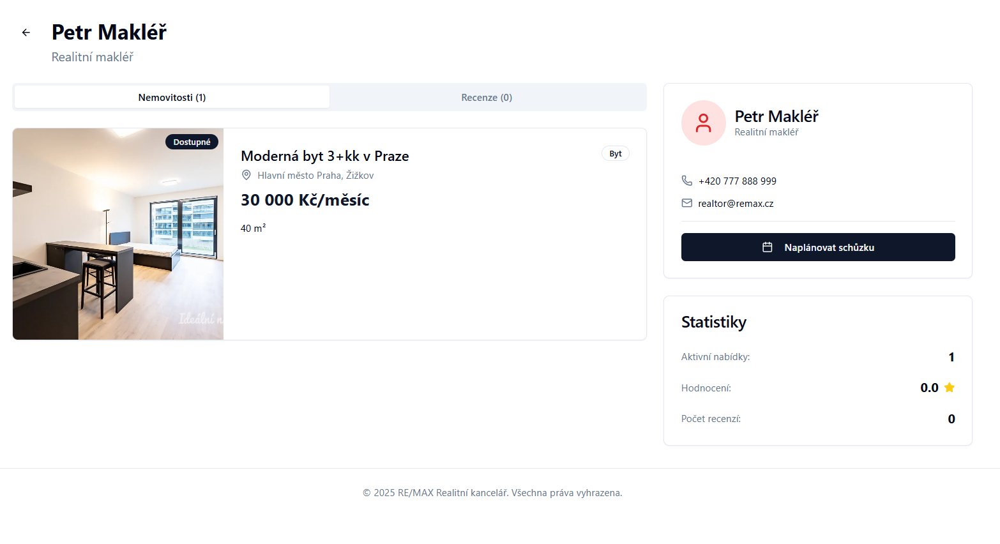

#### 5. Registrace a přihlášení
- **Registrace**: vyplnění formuláře (přihlašovací údaje, osobní údaje, adresa) → automatické přihlášení jako Klient
- **Přihlášení**: uživatelské jméno + heslo
- **Zapomenuté heslo**: možnost resetovat heslo

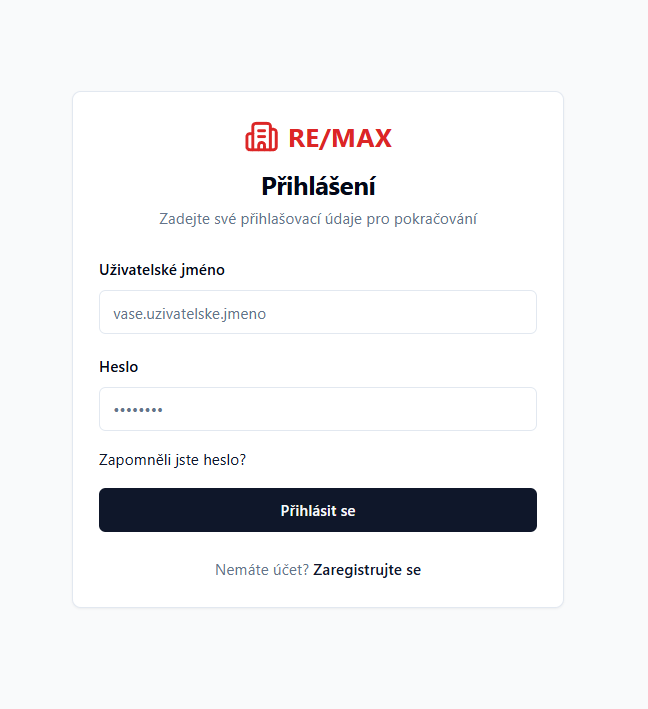
---

## Pro klienty

Klienti mají vše z předchozí sekce plus následující rozšířené funkce.

### Rozšířené funkce

#### 1. Naplánování schůzky
Schůzku můžete naplánovat dvěma způsoby:
- **Z detailu nemovitosti**: tlačítko "Naplánovat prohlídku" → automaticky předvyplněný makléř a nemovitost
- **Ze sekce Schůzky**: navigace **"Schůzky"** → tlačítko "+ Nová schůzka"

**Formulář schůzky:**
- Výběr makléře (povinné)
- Výběr nemovitosti (volitelné)
- Datum a čas
- Typ schůzky: Online / Offline
- Typ setkání: Prohlídka / Konzultace / Další
- Název a popis schůzky

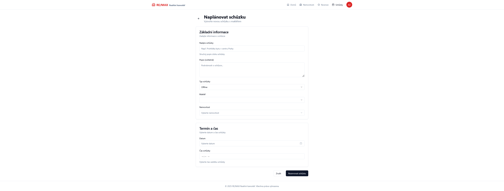
**Výsledek**: Schůzka se statusem "Čeká na potvrzení"

#### 2. Správa schůzek
Navigace: **"Schůzky"** (zobrazení jako kalendář nebo seznam)

**Statistiky:**
- Počet schůzek dnes / nadcházejících / tento měsíc

**Informace u schůzky:**
- Název, popis, datum, čas
- Typ (Online/Offline)
- Status: Čeká na potvrzení (žlutá) / Potvrzeno (zelená) / Zrušeno (červená)
- Kontakt na makléře

**Akce:**
- **Zrušit schůzku** (u schůzek se statusem "Čeká na potvrzení" nebo "Potvrzeno")

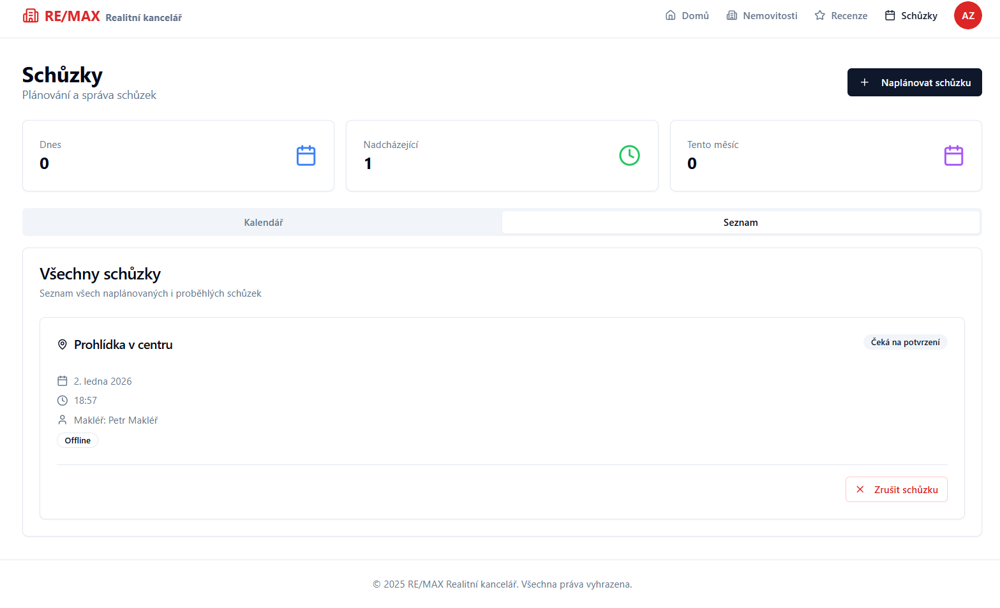
#### 3. Přidání recenze
Navigace: **"Recenze"** → tlačítko "+ Nová recenze"

**Formulář recenze:**
- Výběr makléře
- Číselné hodnocení (1-5 hvězd):
- Textová recenze (volitelné)

#### 4. Editace a smazání recenze
U vlastních recenzí máte možnost:
- **Upravit**: změna hodnocení nebo textu
- **Smazat**: trvalé odstranění recenze

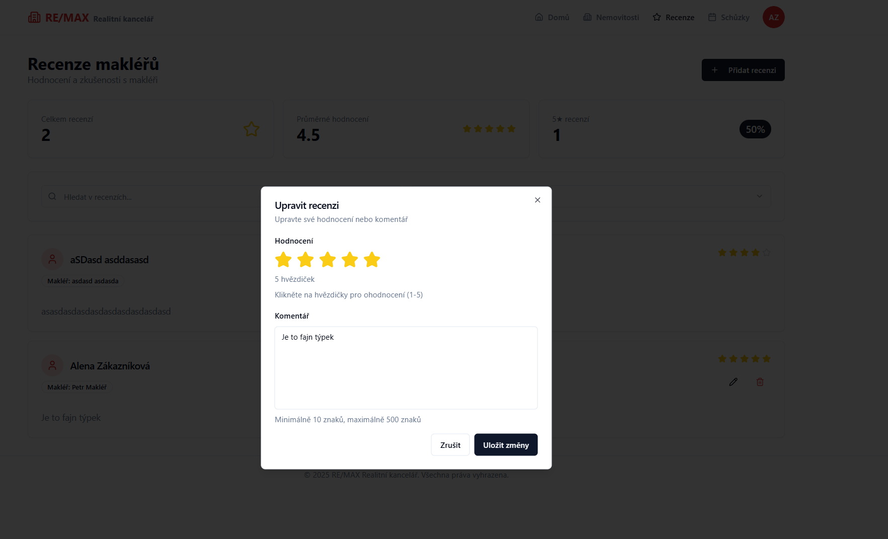
#### 5. Můj profil
Navigace: ikona profilu nebo **"Můj profil"**

**Záložka "Profil":**
- Zobrazení role (nelze měnit)
- Editace osobních údajů: titul, jméno, příjmení, e-mail, telefon
- Editace adresy: ulice, číslo bytu, město, PSČ, země, kraj

**Záložka "Zabezpečení":**
- **Nebezpečná zóna**: možnost smazat účet

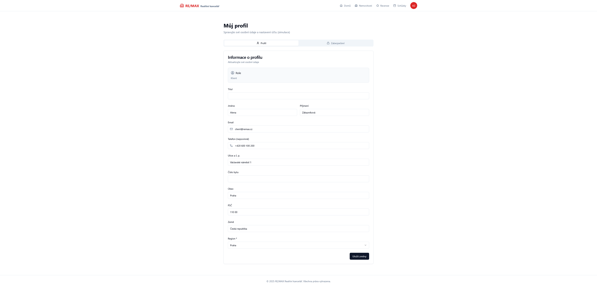
---

## Pro makléře

Makléři mají vše z předchozích sekcí plus následující rozšířené funkce.

### Rozšířené funkce

#### 1. Přidání nemovitosti
Navigace: **"Nemovitosti"** → tlačítko "+ Nová nemovitost"

**Formulář obsahuje následující sekce:**

**Základní informace:**
- Nadpis, popis, typ (Byt/Dům/Pozemek), status (Dostupné/Rezervováno/Prodáno)
- Typ transakce (Prodej/Pronájem), cena

**Detaily nemovitosti:**
- Velikost (m²), počet pokojů, ložnic, koupelen, podlaží, dostupné od
- **Specifické parametry:**
  - **Byty**: počet pater v budově, výtah, balkon, typ vlastnictví
  - **Domy**: plocha pozemku, typ domu, počet pater
  - **Pozemky**: určeno pro bydlení

**Finanční údaje:**
- Způsob zveřejnění ceny, provize, daně, vybavení (Zařízený/Nezařízený/Částečně)

**Parametry budovy:**
- Materiál stavby, stav budovy, energetická třída, lokalita, ochranné pásmo, sklep

**Adresa:**
- Autocomplete pro vyhledávání s automatickým vyplněním GPS souřadnic
- Ulice, číslo popisné, město, PSČ, kraj, země, GPS

**Inženýrské sítě:**
- Výběr dostupných sítí: voda, studna, elektřina, plyn, kanalizace, žumpa, topení, telefon, kabelová TV, recyklace, bezbariérový přístup
- Internet, počet parkovacích míst

**Dopravní možnosti:**
- Výběr: silnice, dálnice, vlak, autobus, MHD, letiště, lodní doprava, trajekt

**Občanská vybavenost:**
- Výběr služeb v okolí: zastávka, nádraží, metro, pošta, bankomat, lékař, veterinář, školy, MŠ, supermarket, obchody, restaurace, hospoda, hřiště

**Fotografie:**
- Nahrání více fotografií (drag & drop nebo výběr), první fotografie = hlavní obrázek

#### 2. Úprava nemovitosti
- Tlačítko **"Upravit"** v detailu vlastní nemovitosti
- Stejný formulář jako při vytváření, ale s předvyplněnými daty

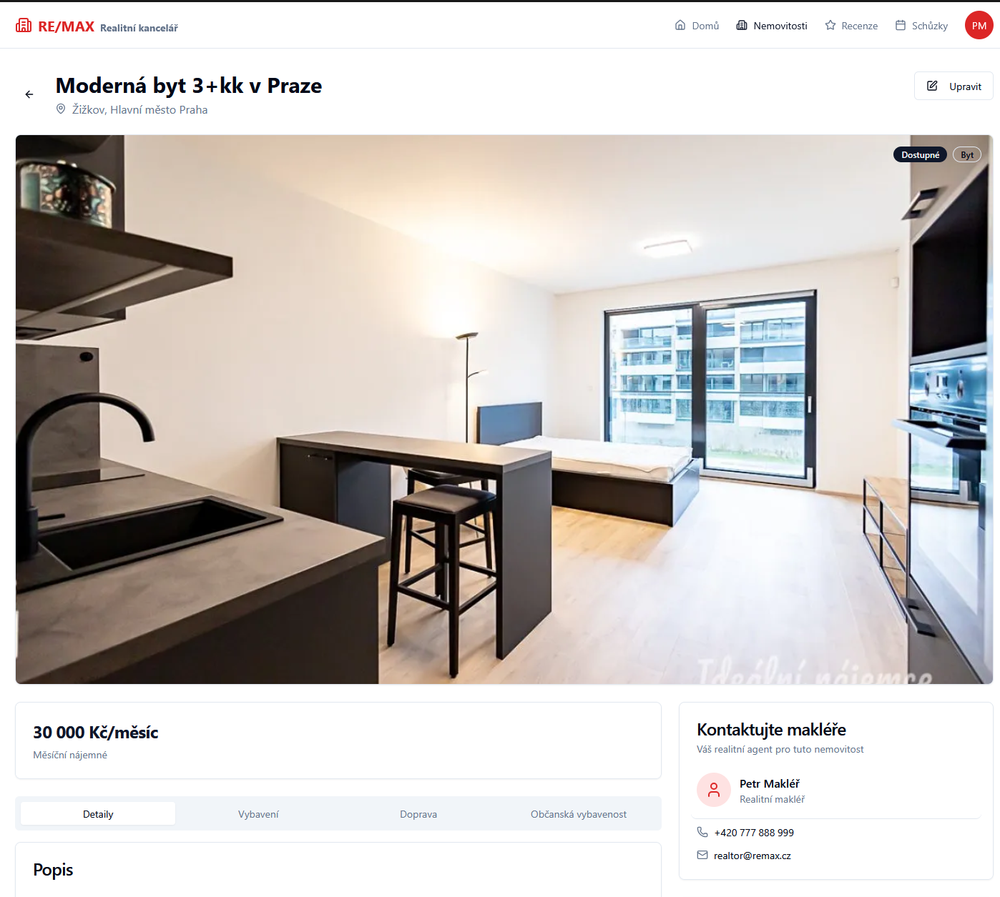
#### 3. Správa schůzek makléře
Navigace: **"Schůzky"**

**Zobrazení schůzek:**
- Vidíte schůzky, kde jste vy jako makléř

**Akce u schůzek se statusem "Čeká na potvrzení":**
- **Potvrdit** → status se změní na "Potvrzeno", klient dostane informaci
- **Zrušit** → status se změní na "Zrušeno"

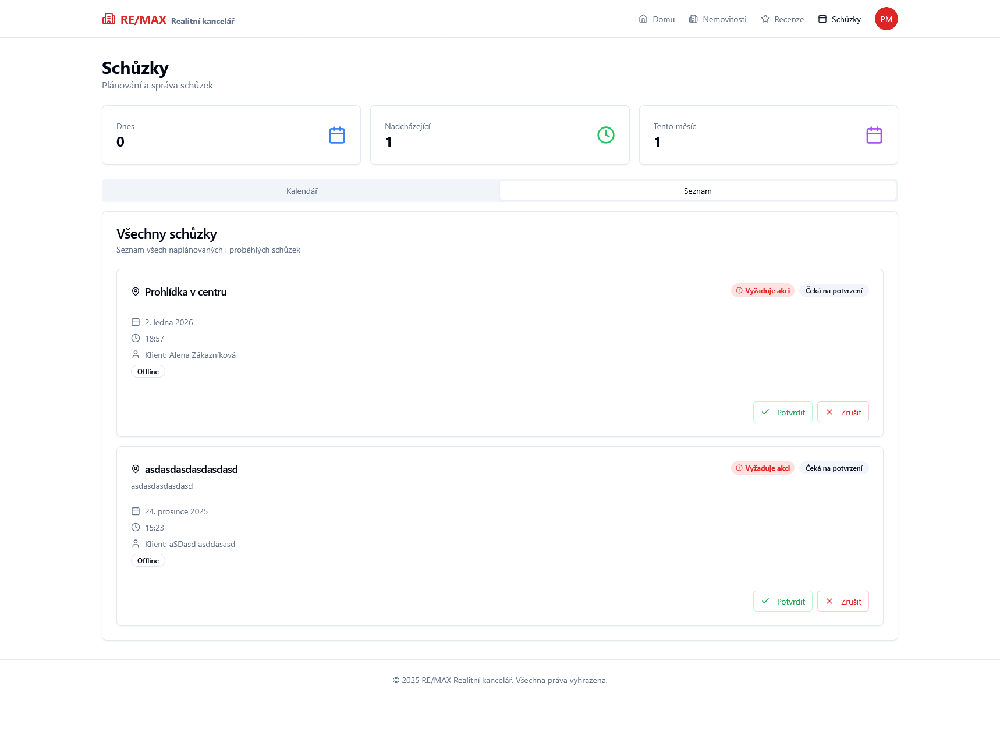
#### 4. Zobrazení recenzí
- **Stránka Recenze**: použití filtru pro vyhledání vašeho jména

